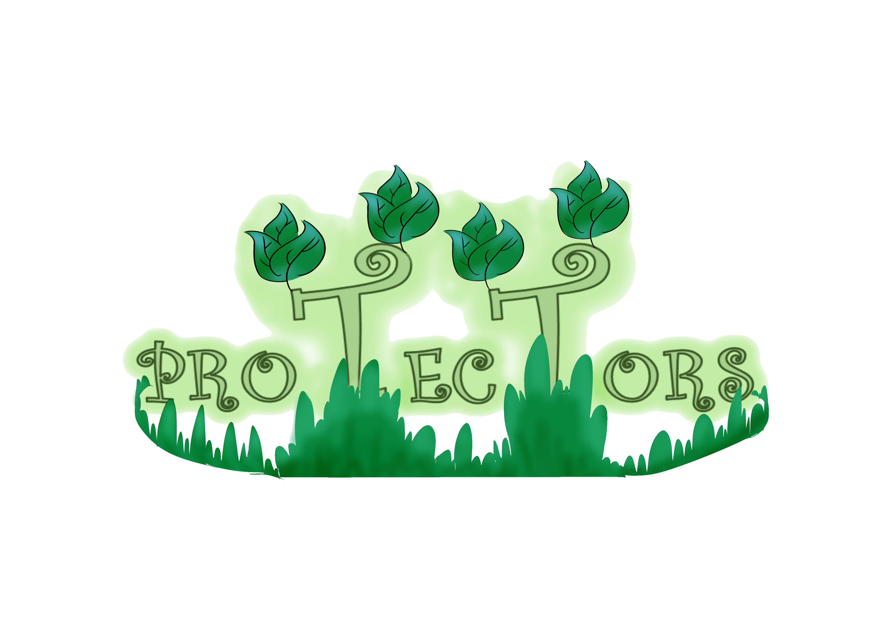

<!-- PROJECT LOGO -->
<br />
<p align="center">
  

  <h3 align="center">Protectors</h3>
  <h4 align="center">Codename: thisGame</h4>

  <p align="center">
    A game where you must protect a budding forest
    <br />
    <br />
    <a href="https://github.com/faberwerks/protectors/issues">Report Bug</a>
  </p>
</p>


<!-- TABLE OF CONTENTS -->
  <h2 style="display: inline-block">Table of Contents</h2>
  <ol>
    <li>
      <a href="#about-the-project">About The Project</a>
      <ul>
        <li><a href="#built-with">Built With</a></li>
      </ul>
    </li>
    <li>
      <a href="#getting-started">Getting Started</a>
      <ul>
        <li><a href="#prerequisites">Prerequisites</a></li>
        <li><a href="#installation">Installation</a></li>
      </ul>
    </li>
    <li><a href="#roadmap">Roadmap</a></li>
    <li><a href="#license">License</a></li>
    <li><a href="#contact">Contact</a></li>
    <li><a href="#acknowledgements">Acknowledgements</a></li>
  </ol>


<!-- ABOUT THE PROJECT -->
## About The Project

[![Protectors Screen Shot][product-screenshot]](https://faberwerks.itch.io/protectors)

<p align="justify">
    <strong>Protectors</strong> (creatively codenamed <em>Project thisGame</em>) is a 2D endless arcade strategy game for Windows. You play as Mother Nature and must plant and protect the trees in your forest. Humans will try to cut them down. Each tree has a seed cost and has a different role to play. You will lose. The question is: how long will you survive? The game is available for free on itch.io <a href="https://faberwerks.itch.io/protectors">here</a>.
</p>

<p align="justify">
    Protectors was not the first game that Faberwerks began developing (that would be <a href="https://faberwerks.itch.io/valanthion">Valanthion</a>). However, it was the first game that we released. Protectors was originally our entry to the 2018 Melon Game Jam. After it ended, we decided to remake it (this time, of course, with much more time) using the exact same concept with improved graphics (we had no artist at the game jam) and better balancing.
</p>

<p align="justify">
    Although this repository is primarily for former members of Faberwerks (which has since disbanded) to use so they can come back to study, use this as reference, or just reminisce, anyone who comes across this project is welcome to see the project. However, you may not use any part of this repository for your own purposes without first confirming with us.
</p>

### Built With

This project was built using the [Unity](https://unity.com/) game engine (version 2018.2.16f1).

<!-- GETTING STARTED -->
## Getting Started

To get a local copy up and running follow these simple steps.

### Prerequisites

Protectors only requires Unity 2018.2.16f1 to run. Any Unity 2018.2.16f1 and possibly Unity 2018.2 version should work without any problems. You can download them [here](https://unity3d.com/get-unity/download/archive).

### Installation

Simply clone the repo using the Git CLI (see below) or through GitHub for Desktop.
```sh
git clone https://github.com/faberwerks/protectors.git
```

<!-- ROADMAP -->
## Roadmap

See the [open issues](https://github.com/faberwerks/protectors/issues) for a list of known issues.

<!-- LICENSE -->
## License

You may not use Protectors or any of its assets for any commercial or non-commercial purposes. All rights belong to Faberwerks. For any questions, please contact us.

<!-- CONTACT -->
## Contact

Faberwerks - [@faberwerks](https://twitter.com/faberwerks) - faberwerks@gmail.com - [itch.io page](https://faberwerks.itch.io/)

Phobez (producer/project manager/project lead) - [itch.io page](https://phobez.itch.io/)

Project Link: [https://github.com/faberwerks/protectors](https://github.com/faberwerks/protectors)

<!-- ACKNOWLEDGEMENTS -->
## Acknowledgements

* [Best-README-Template](https://github.com/othneildrew/Best-README-Template)

<!-- MARKDOWN LINKS & IMAGES -->
[product-screenshot]: images/screenshot.jpg
